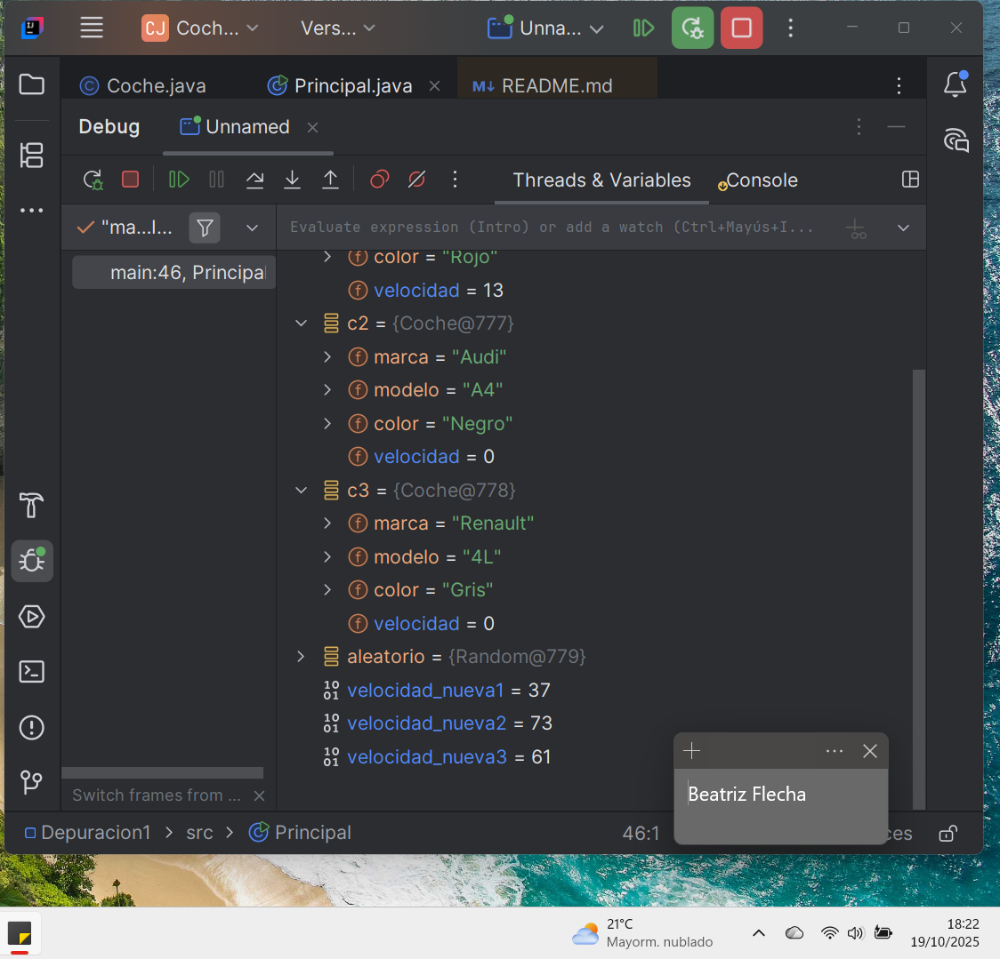

# TASCA 2 - DEPURACIÓN EN INTELLIJ IDEA
## 1. ¿Qué hace el método "main"?
El método main crea tres objetos de tipo "Coche" con diferentes características.

Luego les aplica métodos como "acelera" para aumentar la velocidad, "frena" para reducirla y "pinta" para mostrar como se ven según la velocidad. También calcula nuevas velocidades y las guaarda en variables llamadas "velocidad_nueva1", "velocidad_nueva2" y "velocidad_nueva3"
## Valores en la línea 27
- velocidad_nueva1: 33
- velocidad_nueva2: 8
- velocidad_nueva3: 50
- c: marca = "Fiat"; modelo = "500"; color = "Rojo"; velocidad = 50
- c2: marca = "Audi"; modelo = "A4"; color = "Negro"; velocidad = 33
- c3: marca = "Renault"; modelo = "4L"; color = "Gris"; velocidad = 8

## Valores en la línea 46
- velocidad_nueva1: 37
- velocidad_nueva2: 33
- velocidad_nueva3: 2
- c: marca = "Fiat"; modelo = "500"; color = "Rojo"; velocidad = 13
- c2: marca = "Audi"; modelo = "A4"; color = "Negro"; velocidad = 0
- c3: marca = "Renault"; modelo = "4L"; color = "Gris"; velocidad = 0

Autor: Beatriz Flecha